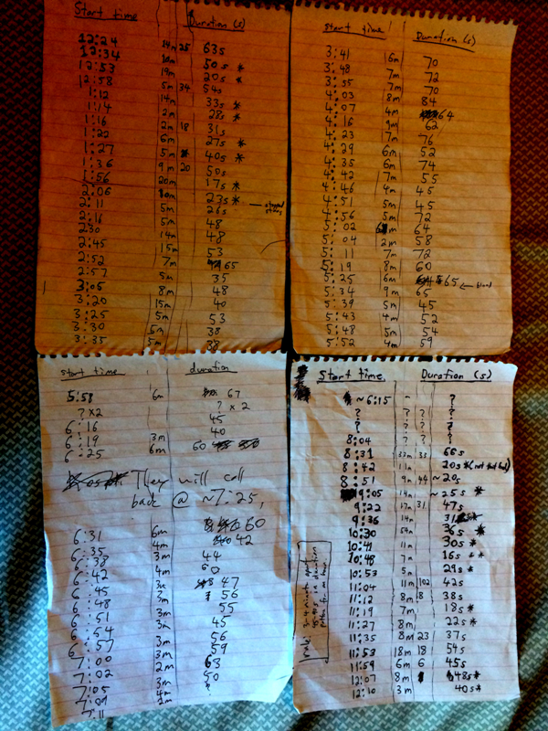
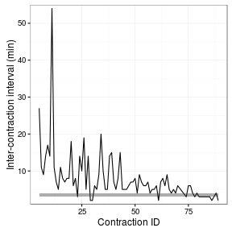

## The birth of Fern

On July 8, 2016 at 11:09pm, my daughter was born.  She is adorable.
Here she is on July 9.


## The contraction data

At about 6:15am on July 8, Fern's Mom started having contractions.
Our midwives said to call them once the contractions were consistently
3-4 minutes apart for at least one hour, and that the contractions
themselves were between 45-90s in duration.  I started collecting
data.



Here are the first (and last) six observations that I recorded.


|   | contractionID|startTime           | duration|
|:--|-------------:|:-------------------|--------:|
|1  |             1|2016-07-08 06:15:00 |       NA|
|2  |             2|NA                  |       NA|
|3  |             3|NA                  |       NA|
|4  |             4|2016-07-08 08:04:00 |       NA|
|5  |             5|2016-07-08 08:31:00 |      66S|
|6  |             6|2016-07-08 08:42:00 |      20S|
|84 |            84|2016-07-08 18:57:00 |      56S|
|85 |            85|2016-07-08 19:00:00 |      59S|
|86 |            86|2016-07-08 19:02:00 |      63S|
|87 |            87|2016-07-08 19:05:00 |      50S|
|88 |            88|2016-07-08 19:09:00 |       NA|
|89 |            89|2016-07-08 19:11:00 |       NA|

Missing data are inevitable.

Of primary interest are the inter-contraction intervals.

```r
dat <- dat %>%
  mutate(interval = as.duration(startTime - lag(startTime)))
knitr:::kable(dat[5:10,])
```


|   | contractionID|startTime           | duration|            interval|
|:--|-------------:|:-------------------|--------:|-------------------:|
|5  |             5|2016-07-08 08:31:00 |      66S| 1620s (~27 minutes)|
|6  |             6|2016-07-08 08:42:00 |      20S|  660s (~11 minutes)|
|7  |             7|2016-07-08 08:51:00 |      20S|   540s (~9 minutes)|
|8  |             8|2016-07-08 09:05:00 |      25S|  840s (~14 minutes)|
|9  |             9|2016-07-08 09:22:00 |      47S| 1020s (~17 minutes)|
|10 |            10|2016-07-08 09:36:00 |      31S|  840s (~14 minutes)|
## An initial model

The first step in model building is to look at the data.


```r
intervalPlot <-
    makeIntervalPlot(dat) +
    scale_y_continuous("Inter-contraction interval (min)",
    expand = c(0, 1))
print(intervalPlot)
```



The inter-contraction intervals are more variable and generally larger
near the beginning of labour.  It looks like the intervals might
converge on 3-4 minutes --- shown by the horizontal band --- just
before we get ready to go to the hospital!  But what kind of model
might determine such convergence?

It looks like the mean inter-contraction interval starts off somewhere
near 30 minutes and then declines to asymptotically approach 3-4
minutes.  A model with these characteristics is given by the
following.


where $y$ and $x$ are the inter-contraction interval and contraction
ID, $\kappa_1$ and $\kappa_2$ are the initial and final
inter-contraction times, $\alpha$ is a parameter controlling the rate
of decline from $\kappa_1$ to $\kappa_2$, and $\epsilon$ is normally
distributed error.


## Accounting for Heterogeneous errors

One of the problems with ...


```r
intervalPlotLog <-
	makeIntervalPlot(dat) +
	scale_y_continuous("Inter-contraction interval (min)\n(log scale)",
                      trans = "log", 
                      breaks = c(2, 4, 8, 16, 32, 64),
		      expand = c(0, 0))
print(intervalPlotLog)
```


```r
datNoNA <- dat %>%
  as_data_frame %>%
  filter(!is.na(interval))
nonLinearFormula <- 
    log(as.numeric(interval) / 60) ~
    log(exp(k1) *      exp(- alpha * contractionID) + 
        exp(k2) * (1 - exp(- alpha * contractionID)))
mod <- try({
nls(nonLinearFormula, data = datNoNA, 
           start = list(alpha = 0.05, k1 = 3.5, k2 = 1.2),
           trace = TRUE)
do.call(plotCurve, as.list(coef(mod)))
summary(mod)
})
```

```
## 25.72467 :  0.05 3.50 1.20
## 19.98647 :  0.0225624 2.5972410 0.9413003
## 19.87928 :  0.01961596 2.58824426 0.65361020
## 19.84303 :  0.01733377 2.58006953 0.25010658
## 19.76538 :   0.01644099  2.57642837 -0.06153443
## 19.71977 :   0.01564724  2.57296818 -0.48277571
## 19.71845 :   0.01493905  2.56970383 -1.11928151
## 19.70684 :   0.01462209  2.56817979 -1.71923878
## 19.69694 :   0.01447198  2.56744188 -2.26266929
## 19.68983 :   0.0143989  2.5670785 -2.7285180
## 19.6891 :   0.0143268  2.5667177 -3.4687007
## 19.689 :   0.01429122  2.56653880 -4.24358857
## 19.68793 :   0.01428238  2.56649428 -4.66380123
## 19.68753 :   0.01427356  2.56644980 -5.30314699
## 19.68728 :   0.01426916  2.56642758 -5.90891400
```

```r
mod
```

```
## [1] "Error in nls(nonLinearFormula, data = datNoNA, start = list(alpha = 0.05,  : \n  step factor 0.000488281 reduced below 'minFactor' of 0.000976562\n"
## attr(,"class")
## [1] "try-error"
## attr(,"condition")
## <simpleError in nls(nonLinearFormula, data = datNoNA, start = list(alpha = 0.05,     k1 = 3.5, k2 = 1.2), trace = TRUE): step factor 0.000488281 reduced below 'minFactor' of 0.000976562>
```

This is a stupid error.  The nonlinear solver chases unrealistically
low asymptotic inter-contraction intervals.
